# WhatsApp Bot Conversation Script

This document details the node-by-node conversational flow, decision trees, input validations, error handling, and follow-up automation templates for the **MathematicsGeek.com** Vedic Maths Game Funnel.

---

## 🗺️ Decision Tree Overview

```mermaid
graph TD
    %% Entry
    Start([User Initiates / Opts-in]) --> EntryNode[Node 1: Entry Greeting]
    EntryNode -->|Start Challenge| Level1[Node 2.1: Level 1 - Mult by 11]
    EntryNode -->|Know More| InfoNode[Node 1.1: Info Screen]
    InfoNode -->|Back to Challenge| Level1
    
    %% Level 1
    Level1 -->|Valid Answer| Check1{Is Correct?}
    Check1 -->|Yes| L1Praise[Node 2.1.P: Praise + Vedic Explanation]
    Check1 -->|No| L1Retry[Node 2.1.F: Vedic Expl + Retry/Skip]
    L1Praise --> Level2[Node 2.2: Level 2 - Squares ending in 5]
    L1Retry -->|Retry| Level1
    L1Retry -->|Skip| Level2

    %% Level 2
    Level2 -->|Valid Answer| Check2{Is Correct?}
    Check2 -->|Yes| L2Praise[Node 2.2.P: Praise + Vedic Explanation]
    Check2 -->|No| L2Retry[Node 2.2.F: Vedic Expl + Retry/Skip]
    L2Praise --> Level3[Node 2.3: Level 3 - Base 100 Mult Below]
    L2Retry -->|Retry| Level2
    L2Retry -->|Skip| Level3

    %% Level 3
    Level3 -->|Valid Answer| Check3{Is Correct?}
    Check3 -->|Yes| L3Praise[Node 2.3.P: Praise + Vedic Explanation]
    Check3 -->|No| L3Retry[Node 2.3.F: Vedic Expl + Retry/Skip]
    L3Praise --> Level4[Node 2.4: Level 4 - Base 100 Mult Above]
    L3Retry -->|Retry| Level3
    L3Retry -->|Skip| Level4

    %% Level 4
    Level4 -->|Valid Answer| Check4{Is Correct?}
    Check4 -->|Yes| L4Praise[Node 2.4.P: Praise + Vedic Explanation]
    Check4 -->|No| L4Retry[Node 2.4.F: Vedic Expl + Retry/Skip]
    L4Praise --> Level5[Node 2.5: Level 5 - Near 1000 Mult]
    L4Retry -->|Retry| Level4
    L4Retry -->|Skip| Level5

    %% Level 5
    Level5 -->|Valid Answer| Check5{Is Correct?}
    Check5 -->|Yes| L5Praise[Node 2.5.P: Praise + Vedic Explanation]
    Check5 -->|No| L5Retry[Node 2.5.F: Vedic Expl + Retry/Skip]
    L5Praise --> ScoreSummary[Node 3: Score Summary]
    L5Retry -->|Retry| Level5
    L5Retry -->|Skip/Continue| ScoreSummary

    %% Profiling & Capture
    ScoreSummary -->|Unlock / Book| ProfName[Node 4.1: Ask Name]
    ProfName -->|Valid Name| ProfGrade[Node 4.2: Ask Grade]
    ProfGrade -->|Select Grade| ProfCity[Node 4.3: Ask City]
    ProfCity -->|Input City| ProfPhone[Node 4.4: Ask Parent Phone]
    ProfPhone -->|Valid Phone| Pitches{Grade Segment}
    
    %% Pitch & CTA
    Pitches -->|Grades 3-5| PitchBasics[Node 5.1: Basics & Speed Pitch]
    Pitches -->|Grades 6-8| PitchExams[Node 5.2: Speed & Exam Confidence Pitch]
    Pitches -->|Grades 9-12| PitchComp[Node 5.3: Competitive Exams/SAT Pitch]
    
    PitchBasics --> FinalCTA[Node 6: Final CTA - Booking]
    PitchExams --> FinalCTA
    PitchComp --> FinalCTA
    
    FinalCTA -->|Book Slot| BookConfirm[Node 7.1: Demo Booked Trigger]
    FinalCTA -->|Talk to Counselor| TalkConfirm[Node 7.2: Counselor Alert Trigger]

    %% Validation / Fallback (Global)
    style Start fill:#4CAF50,stroke:#388E3C,stroke-width:2px,color:#fff
    style FinalCTA fill:#FF5722,stroke:#E64A19,stroke-width:2px,color:#fff
```

---

## 💬 Conversation Script Node-by-Node

### Node 1: Entry Greeting (The Hook)
* **Trigger**: User sends standard keyword (e.g., "START", "MATH", or clicks ad link).
* **Copy**:
  > 👋 Hey there! Welcome to **MathematicsGeek.com**! 
  > 
  > Can you solve equations faster than a calculator? 🧠⚡ Let's find out!
  > 
  > We challenge you to a **60-Second Vedic Maths Game**. It has 5 levels, and we'll teach you a neat trick after each level. No pressure, just fun!
  > 
  > Are you ready to level up your brain? 🚀
* **Interactive Elements (Buttons)**:
  * Button 1: `Start Challenge 🚀` (Triggers Node 2.1)
  * Button 2: `Know More 📘` (Triggers Node 1.1)

---

### Node 1.1: Brand Info Screen (Secondary Flow)
* **Trigger**: Click `Know More 📘`.
* **Copy**:
  > 📘 **Vedic Mathematics** is an ancient mental calculation system that helps students solve math problems 10x faster with zero stress.
  > 
  > Over 15,000+ students (Grades 3–12) have used our techniques to ace school exams, competitive tests, and build massive math confidence!
  > 
  > Best way to learn is by doing! Wanna try the quick challenge now? 👇
* **Interactive Elements (Buttons)**:
  * Button 1: `Let's Play! 🚀` (Triggers Node 2.1)

---

### Node 2.x: The Gameplay Engine (Levels 1–5)

#### Level 1: Multiply by 11
* **Question**:
  > **Level 1/5: The 11s Shortcut 🚀**
  > What is **$35 \times 11$**?
  > 
  > *Type your answer below!* 📝
* **Validation**: Positive integer.
* **Target Answer**: `385`
* **Vedic Explanations**:
  * **Correct**:
    > 🎉 **Spot on! $35 \times 11 = 385$.**
    > 💡 **The Vedic Trick:** For any 2-digit number multiplied by 11, just add the digits ($3 + 5 = 8$) and place it in between. Easy as pie! 🥧
  * **Incorrect / Fallback**:
    > 🧐 Not quite! Let's check out the **Vedic Shortcut**:
    > To multiply $35 \times 11$, add the digits $3 + 5 = 8$. Now sandwich that $8$ in between $3$ and $5$ to get **$385$**!
* **Interactive Buttons on Feedback**:
  * If Correct: `Next Level 🚀` (Triggers Node 2.2)
  * If Incorrect: `Retry 🔄` (Triggers Node 2.1) or `Skip Level ➡️` (Triggers Node 2.2)

---

#### Level 2: Squares Ending in 5
* **Question**:
  > **Level 2/5: Speed Squares ⚡**
  > What is **$65 \times 65$** (or $65^2$)?
  > 
  > *Hint: A calculator takes 3 seconds. You can do it in 1!* 😉
* **Validation**: Positive integer.
* **Target Answer**: `4225`
* **Vedic Explanations**:
  * **Correct**:
    > 🌟 **Superb! $65^2 = 4225$.**
    > 💡 **The Vedic Trick:** Multiply the first digit by its next number ($6 \times 7 = 42$) and suffix **25** at the end. That's $42$ and $25 \rightarrow 4225$!
  * **Incorrect / Fallback**:
    > 🧐 Almost! Here is the **Vedic Trick**:
    > For numbers ending in 5, multiply the tens digit by the next consecutive number ($6 \times 7 = 42$), and always end with $25$. Result: **$4225$**!
* **Interactive Buttons on Feedback**:
  * If Correct: `Next Level 🚀` (Triggers Node 2.3)
  * If Incorrect: `Retry 🔄` (Triggers Node 2.2) or `Skip Level ➡️` (Triggers Node 2.3)

---

#### Level 3: Base 100 Multiplication (Below Base)
* **Question**:
  > **Level 3/5: Base 100 Mastery (Below) 🎯**
  > What is **$96 \times 97$**?
  > 
  > *This usually takes a pencil and paper, but there's a trick...*
* **Validation**: Positive integer.
* **Target Answer**: `9312`
* **Vedic Explanations**:
  * **Correct**:
    > 🔥 **Genius! $96 \times 97 = 9312$.**
    > 💡 **The Vedic Trick:** Both are close to 100. $96$ is $-4$ below, $97$ is $-3$ below.
    > 1. Cross-subtract: $96 - 3$ (or $97 - 4$) $= 93$.
    > 2. Multiply deficits: $4 \times 3 = 12$.
    > 3. Combined $\rightarrow 9312$. Mind-blown? 🤯
  * **Incorrect / Fallback**:
    > 🧐 Don't worry, this is advanced math! Here is the **Vedic Trick**:
    > - $96$ is $-4$ below 100, $97$ is $-3$ below 100.
    > - Cross subtract: $96 - 3 = 93$.
    > - Multiply differences: $4 \times 3 = 12$.
    > Combined answer: **$9312$**!
* **Interactive Buttons on Feedback**:
  * If Correct: `Next Level 🚀` (Triggers Node 2.4)
  * If Incorrect: `Retry 🔄` (Triggers Node 2.3) or `Skip Level ➡️` (Triggers Node 2.4)

---

#### Level 4: Base 100 Multiplication (Above Base)
* **Question**:
  > **Level 4/5: Base 100 Mastery (Above) 📈**
  > What is **$103 \times 105$**?
  > 
  > *Can you do this in 3 seconds? Let's check!*
* **Validation**: Positive integer.
* **Target Answer**: `10815`
* **Vedic Explanations**:
  * **Correct**:
    > 🚀 **Incredible! $103 \times 105 = 10815$.**
    > 💡 **The Vedic Trick:** Both are above 100. $103$ is $+3$ over, $105$ is $+5$ over.
    > 1. Cross-add: $103 + 5$ (or $105 + 3$) $= 108$.
    > 2. Multiply surpluses: $3 \times 5 = 15$.
    > 3. Combined $\rightarrow 10815$!
  * **Incorrect / Fallback**:
    > 🧐 Here's how to calculate it instantly:
    > - $103$ is $+3$ above 100, $105$ is $+5$ above 100.
    > - Cross-add surplus: $103 + 5 = 108$.
    > - Multiply differences: $3 \times 5 = 15$.
    > Combined answer: **$10815$**!
* **Interactive Buttons on Feedback**:
  * If Correct: `Final Level 🏆` (Triggers Node 2.5)
  * If Incorrect: `Retry 🔄` (Triggers Node 2.4) or `Skip Level ➡️` (Triggers Node 2.5)

---

#### Level 5: Near 1000 Multiplication (Super Challenge)
* **Question**:
  > **Level 5/5: The Grand Finale! 🏆**
  > What is **$991 \times 996$**?
  > 
  > *This is 3-digit multiplication in your head. Give it a shot!*
* **Validation**: Positive integer.
* **Target Answer**: `987036`
* **Vedic Explanations**:
  * **Correct**:
    > 👑 **Absolute Math Emperor! $991 \times 996 = 987036$.**
    > 💡 **The Vedic Trick:** Base is 1000. $991$ is $-9$, $996$ is $-4$.
    > 1. Cross-subtract: $991 - 4 = 987$.
    > 2. Multiply deficits: $9 \times 4 = 36$ (write as $036$ for base 1000).
    > Combined $\rightarrow 987036$!
  * **Incorrect / Fallback**:
    > 🧐 No worries, that's a tough one! Here is the Vedic breakdown:
    > - Base is 1000. Deficits: $991 \rightarrow -9$, $996 \rightarrow -4$.
    > - Cross-subtract: $991 - 4 = 987$.
    > - Multiply deficits: $9 \times 4 = 36$ (must fill 3 slots for base 1000 $\rightarrow 036$).
    > Result: **$987036$**!
* **Interactive Buttons on Feedback**:
  * If Correct/Incorrect: `See My Results 📊` (Triggers Node 3)

---

### Node 3: Score Summary
* **Trigger**: Click `See My Results 📊` after Level 5.
* **Copy**:
  > 📊 **Vedic Challenge Summary**
  > 
  > * Score: `{{score}}/5 Correct`
  > * Speed Rank: 🏆 **Top 15%** of math wizards!
  > 
  > You've unlocked the basics! Want to learn how to do division, cube roots, and complex fractions in under 5 seconds? 🔓
* **Interactive Elements (Buttons)**:
  * Button 1: `Unlock Advanced Tricks 🔓` (Triggers Node 4.1 - Profile start)
  * Button 2: `Book Free Live Class 📅` (Triggers Node 4.1 - Profile start with high intent flag)

---

### Node 4.x: Progressive Profiling & Lead Capture

#### Node 4.1: Capture Name
* **Trigger**: Click any button on Node 3.
* **Copy**:
  > Great! First, what is the student's name? ✍️
* **Validation**: Text string, length between 2 and 50 characters, no numbers.
* **On Error**: Triggers Error Handler (Text Fallback).

---

#### Node 4.2: Capture Grade
* **Trigger**: Valid name provided.
* **Copy**:
  > Awesome to meet you, **{{name}}**! 👋
  > 
  > What class/grade are you currently in? This helps us customize the Vedic Math tricks for your school level! 🎒
* **Interactive Elements (List/Buttons)**:
  * Button 1: `Grade 3–5 🧸` (Basics / Foundations)
  * Button 2: `Grade 6–8 📚` (School Exams & Algebra Speed)
  * Button 3: `Grade 9–12 🎓` (Competitive Exams & SAT/ACT)
* **Validation**: Selection of one of the options.

---

#### Node 4.3: Capture City (Optional)
* **Trigger**: Grade selected.
* **Copy**:
  > Perfect! Which city do you live in? 🏙️ *(Or tap Skip below)*
* **Interactive Elements (Buttons)**:
  * Button 1: `Skip ➡️`
* **Validation**: Text format or Skip click.

---

#### Node 4.4: Capture Parent's Phone (Optional Verification)
* **Trigger**: City input or Skip.
* **Copy**:
  > Last step, **{{name}}**! 
  > 
  > To send your Personalized Vedic Cheat Sheet PDF, please provide your parents' phone/WhatsApp number: 📱 *(Or tap Skip below)*
* **Interactive Elements (Buttons)**:
  * Button 1: `Skip ➡️`
* **Validation**: Phone number regex `/^\+?[0-9]{10,15}$/` or Skip click.

---

### Node 5.x: Dynamic Pitch & Segmentation

#### Node 5.1: Segment Grades 3–5 (Foundation & Fun)
* **Trigger**: Grade 3–5 selected.
* **Copy**:
  > 🧸 **MathematicsGeek for Young Wizards (Grades 3-5)**
  > 
  > At this age, children either fall in love with numbers or get scared of them. Vedic Maths turns calculation into a game of shapes and patterns!
  > 
  > 📈 **Outcome:** 5x faster mental math, zero exam anxiety, and a genuine love for mathematics!
  > 👥 **Social Proof:** 6,400+ primary kids trained worldwide!

---

#### Node 5.2: Segment Grades 6–8 (Exam Prep & Speed)
* **Trigger**: Grade 6–8 selected.
* **Copy**:
  > 📚 **MathematicsGeek Middle School Boost (Grades 6-8)**
  > 
  > School curriculum is getting heavy with algebra, decimals, and geometry. Vedic Math shortcuts help check long calculations in under 2 seconds!
  > 
  > 📈 **Outcome:** Cut exam calculation errors by 90%, finish math papers 20 minutes early!
  > 👥 **Social Proof:** 9,200+ middle schoolers have aced their finals with us!

---

#### Node 5.3: Segment Grades 9–12 (Competitive Exams)
* **Trigger**: Grade 9–12 selected.
* **Copy**:
  > 🎓 **MathematicsGeek Elite Math Prep (Grades 9-12 / SAT / ACT)**
  > 
  > In competitive exams, time is the ultimate filter. Vedic tricks allow you to bypass heavy calculations and spot answers instantly!
  > 
  > 📈 **Outcome:** Solve complex quadratic equations, square roots, and ratios in under 5 seconds!
  > 👥 **Social Proof:** Hundreds of students got perfect 800 scores on SAT Math.

---

### Node 6: Conversion Call-to-Action (Demo Offer)
* **Trigger**: Immediately follows the segment pitch.
* **Copy**:
  > 🎁 **Exclusive Offer for {{name}}!**
  > 
  > We are hosting a **Free 1-on-1 Live Vedic Maths Session** this week with our Senior Coach. We will identify your calculation roadblocks and teach 3 secret techniques!
  > 
  > Grab a spot before they fill up! 📅
* **Interactive Elements (Buttons)**:
  * Button 1: `Book Free Slot 📅` (Redirects to Calendly/GCal and triggers Event: `demo_clicked`)
  * Button 2: `Talk to Counselor 📞` (Triggers sales alert callback request)

---

## 🛠️ Error Handling & Fallback Responses

### Global Error Handling Rules
1. **Invalid Numeric Answers in Game**:
   If user answers with letters or symbols during the game:
   > ⚠️ *Whoops! Please enter a number containing only digits (e.g., 385).*
2. **Invalid Name Format**:
   If name contains numbers or symbols:
   > ⚠️ *Please write a valid name (letters only, e.g., Rohan).*
3. **Invalid Phone Format**:
   > ⚠️ *Please write a valid 10-15 digit phone number including country code (e.g., +15550199).*
4. **General Fallback (Unrecognized Message)**:
   If the user types arbitrary text during button-only nodes:
   > 🤔 *I didn't quite catch that. Please use one of the buttons below to continue, or type "start" to restart the Vedic Maths Game!*

---

## 📅 Follow-up Automation Templates (Drop-off Recovery)

*Condition: User started the game but did not complete lead capture, or captured lead but did not book a demo.*

### Day 1: Value Hook (The division by 9 trick)
* **Trigger**: 24 hours post drop-off.
* **Copy**:
  > 👋 Hey! We missed you yesterday!
  > Here is a quick 2-second Vedic Trick: **Dividing any number by 9**.
  > 
  > For $23 \div 9$:
  > 1. The first digit $2$ is your quotient.
  > 2. Add digits ($2+3 = 5$) $\rightarrow$ this is your remainder.
  > Answer is **2 remainder 5** (or $2.555...$)!
  > 
  > Want to learn more shortcuts? Let's pick up where you left off! 👇
* **Buttons**:
  * `Resume Challenge 🚀`
  * `Book Free Class 📅`

### Day 2: Social Proof / Video Testimonial
* **Trigger**: 48 hours post drop-off.
* **Copy**:
  > "My daughter Aarohi used to cry during math homework. After just 3 classes of Vedic Maths, she calculates faster than me!" — Smita (Parent) 👩‍👧
  > 
  > Watch Aarohi solve a 5-digit square root in 4 seconds: [Watch Video Video Link]
  > 
  > Give your child the gift of math confidence. Book a free live class: 👇
* **Buttons**:
  * `Book Free Class 📅`
  * `Play Math Game 🎮`

### Day 3: Urgency / Scarcity Limit
* **Trigger**: 72 hours post drop-off.
* **Copy**:
  > ⏰ **Last Chance, {{name}}!**
  > 
  > The free 1-on-1 Vedic Maths assessment slots are almost fully booked for this week. Only **3 spots** remain in your region.
  > 
  > Don't miss this opportunity to triple your calculation speed! 👇
* **Buttons**:
  * `Claim Free Spot Now 🎁`
