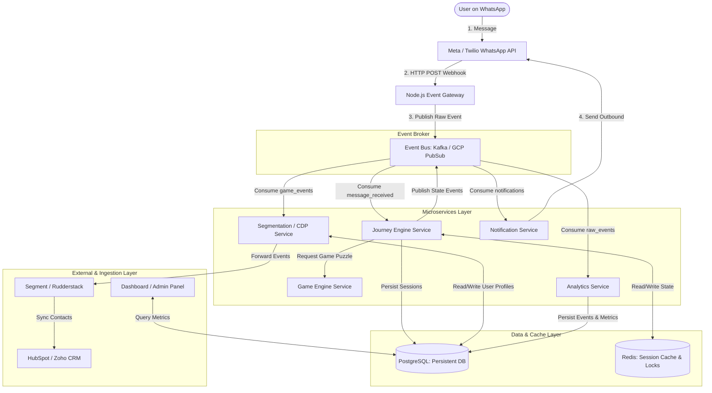

# Production Architecture: Distributed Event-Driven Bot Platform

This document details the transition plan and system architecture required to scale the **MathematicsGeek** WhatsApp Bot platform from the current modular monorepo into a distributed, event-driven microservices architecture.

---

## 🏛️ System Architecture Diagram

---

## 🔍 Layer-by-Layer Breakdown

### 1. Ingress & Gateway Layer (Node.js Gateway)
* **Goal**: Minimize webhook response times to satisfy Meta’s strict timeout limits (under 3 seconds).
* **Implementation**: A stateless, highly optimized service. When a webhook hits, it validates the request signature, immediately pushes the raw payload to the Event Bus (Kafka/PubSub), and returns an HTTP `200 OK` back to Meta. It performs **no** database queries or business logic.

### 2. Event Broker (Kafka / Pub/Sub)
* **Goal**: Decoupling and fault tolerance.
* **Topics**:
  * `whatsapp-incoming`: Raw payload received from users.
  * `journey-state-changes`: Emitted when a user changes states.
  * `performance-logged`: Emitted when a math quiz answer is verified.
  * `outbound-notifications`: Messages waiting to be dispatched to WhatsApp.

### 3. Microservices Layer
* **Journey Engine Service**: Consumes from `whatsapp-incoming`. Validates session locks in Redis, computes state transitions based on JSON workflow definitions, and emits state changes.
* **Game Engine Service**: Acts as a stateless calculation microservice. Generates Vedic math questions, verifies answers, and maps concept mastery scores.
* **Segmentation / CDP Service**: Consumes from `journey-state-changes` and `performance-logged`. Re-evaluates segment filters (e.g. Wizard, Struggling) and updates CRM metrics.
* **Notification Service**: Manages outbound rate limits, complies with WhatsApp templates, handles session windows (24-hour limits), and retries failed dispatches.
* **Analytics Service**: Collects all raw event streams to compute drop-off funnels, conversion rates, and A/B test performance.

### 4. Data & Caching Layer
* **Redis**: Used for:
  1. *Distributed Locks*: Prevents race conditions if a user double-taps buttons or sends concurrent messages.
  2. *Active Sessions*: Caches the current state of active chats for sub-millisecond retrieval by the Journey Engine.
* **PostgreSQL**: The single source of truth for persistent data (`users`, `sessions_historical`, `behavioral_logs`, `performance_data`).

### 5. Integrations & CRM (Segment / Rudderstack)
* Instead of calling HubSpot APIs directly inside the bot loop (which blocks execution), events are routed through Segment/Rudderstack to update CRM contacts and marketing automation systems asynchronously.

---

## 🚀 Transition Strategy: Local Monolith to Microservices

Our current local monorepo has been structured to make this migration straightforward:

| Current Monolith File | Target Production Service | Migration Action Required |
| :--- | :--- | :--- |
| [backend/database.js](file:///Users/fakirs/Documents/Whatsapp%20conversational%20bot/backend/database.js) | Postgres Schema & Redis Session Store | Port schema to PostgreSQL tables. Replace SQLites promise wrappers with an ORM (Prisma/Knex) and configure Redis Client for session caching. |
| [backend/journeyEngine.js](file:///Users/fakirs/Documents/Whatsapp%20conversational%20bot/backend/journeyEngine.js) | Journey Engine Service | Extract the transition loop into a containerized Node.js service. Subscribe it to the incoming message queue. |
| [backend/gameEngine.js](file:///Users/fakirs/Documents/Whatsapp%20conversational%20bot/backend/gameEngine.js) | Game Engine Service | Wrap in a microservice API or publish as a shared library utility. |
| [backend/segmentation.js](file:///Users/fakirs/Documents/Whatsapp%20conversational%20bot/backend/segmentation.js) | Segmentation / CDP Service | Run as a background consumer listening to event broker streams rather than running synchronously. |
